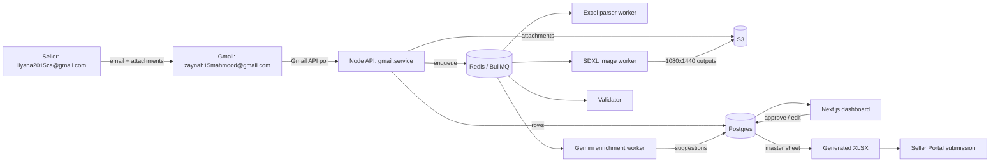
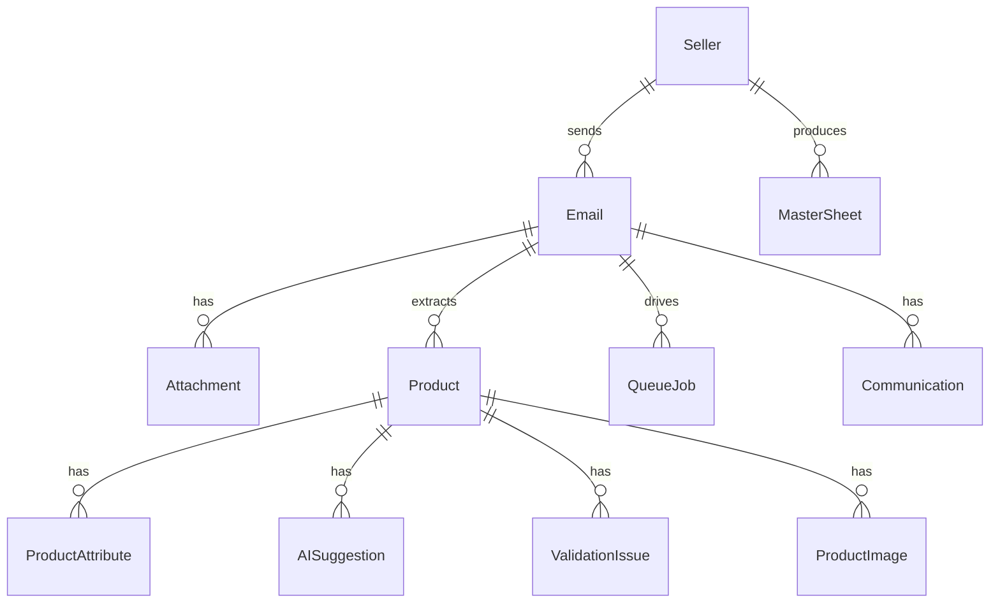
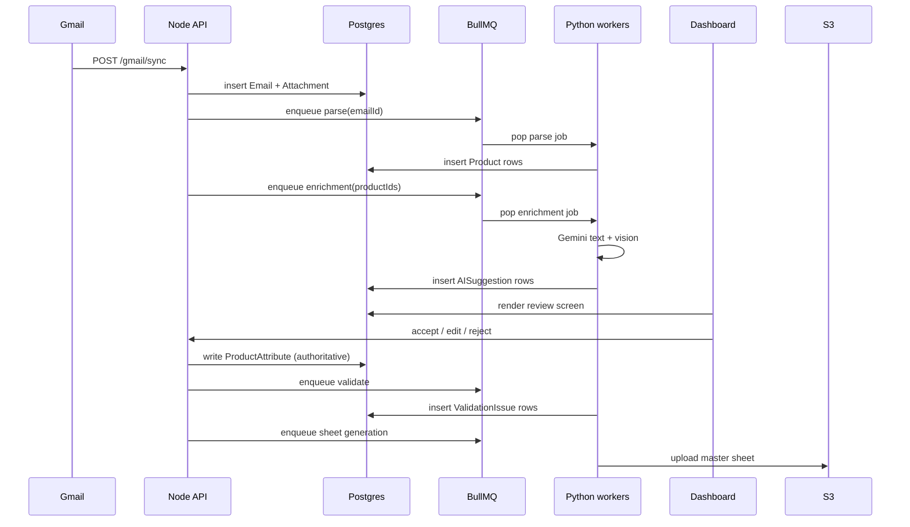

# Architecture

## High-level flow

## Component responsibilities

| Component | Role |
|-----------|------|
| `apps/web` | Next.js 14 dashboard for the ops team. Server components for data fetching, client components for interaction. |
| `apps/api` | Node/Express service. Owns Postgres + BullMQ + Gmail OAuth + S3. |
| `workers/python/enrichment` | FastAPI service wrapping Gemini Pro. Runs text + vision inference and outputs attribute suggestions. |
| `workers/python/image_processing` | FastAPI service wrapping OpenCV detectors + SDXL inpaint. Produces 1080×1440 outpaints with subject preservation. |
| Postgres | Source of truth for emails, products, attributes, suggestions, jobs, sheets. |
| Redis + BullMQ | Job orchestration: `parse`, `enrichment`, `image`, `validate`, `sheet`, `notify` queues. |
| S3 | Binary storage for attachments, original images, enhanced images, master sheets. |

## Data model (simplified)

Full Prisma schema lives in `apps/api/prisma/schema.prisma`.

## Job lifecycle

## Important data-source policy

Gemini prompts **explicitly forbid** Tata CLiQ as a reference. Allowed cross-reference sources for fashion attribute inference:

- Myntra
- Ajio
- Amazon Fashion
- The brand's own website / official channels

This is enforced in `workers/python/enrichment/gemini_client.py` (see `ENRICHMENT_SYSTEM_PROMPT`).

## Image pipeline

Sellers upload 1200×1200. Portal needs 1080×1440 (3:4 portrait). Naive resize crops heads/hands or adds white padding.

Our pipeline:

1. **Detect** subject bbox + keypoints (head, hands, garment hem) via OpenCV + lightweight pose model.
2. **Plan canvas**: compute padding so the subject bbox sits inside the 1080×1440 target with safe margins above head, below feet/hem, and around hands.
3. **Inpaint padded regions** using SDXL with a prompt seeded from the product's category, color family, and a neutral studio backdrop description.
4. **Compose**: paste the original subject region untouched onto the inpainted canvas (preserves garment integrity).
5. **QA**: compute `head_crop_risk`, `hand_crop_risk`, `garment_integrity` scores; flag low-integrity outputs to the Image Studio for human review.
